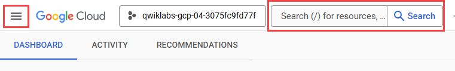
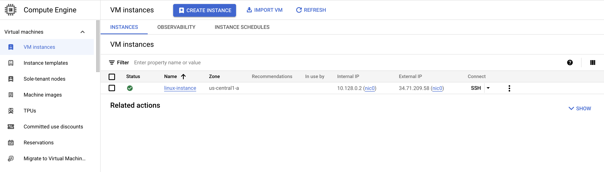

## **Cloud Natural Language API**

### **Overview**
Natural language is the language that humans use to communicate with each other. Natural language processing (NLP) is a field of computer science that is concerned with the interaction between computers and human language. NLP research has the goal of enabling computers to understand and process human language in a way that is similar humans.

The Cloud Natural Language API is a cloud-based service that provides natural language processing capabilities. It can be used to analyze text, identify entities, extract information, and answer questions.

#### Cloud Natural Language API features
**Entity Recognition:** Identify entities in text, such as people, places, and things.          
**Sentiment Analysis:** Analyze the sentiment of text, such as whether it is positive, negative, or neutral.  
**Information Extraction:** Extract information from text, such as dates, times, and price.  
**Question Answering:** Answer questions about text.  
**Integrated REST API:** Access via REST API. Text can be uploaded in the request or integrated with Cloud Storage.

#### Prerequisites

Before starting, you should be familiar with:
- Create an API key
- Use the Cloud Natural Language API to extract "entities" (e.g. people, places, and events) from a snippet of text.

### How to start Google Cloud console
- **Open Google Cloud console** use your Google Cloud account credentials
- Google Cloud console opens in this tab
- To access Google Cloud products and services, click the **Navigation menu** or type the service or product name in the **Search field**.


### Activate Cloud Shell

Cloud Shell is a virtual machine that is loaded with development tools. It offers a persistent 5GB home directory and runs on the Google Cloud. Cloud Shell provides command-line access to your Google Cloud resources.
1. Click Activate Cloud Shell **Activate Cloud Shell** icon at the top of the Google Cloud console.
2. Click through the following windows:
    - Continue through the Cloud Shell information window.
    - Authorize Cloud Shell to use your credentials to make Google Cloud API calls.  

`gcloud` is the command-line tool for Google Cloud. It comes pre-installed on Cloud Shell and supports tab-completion.   
3. (Optional) You can list the active account name with this command:
```
gcloud auth list
```
4. Click **Authorize.**

**Output:**
```
ACTIVE: *
ACCOUNT: "ACCOUNT"

To set the active account, run:
    $ gcloud config set account `ACCOUNT`
```
5. (Optional) You can list the project ID with this command:
```
gcloud config list project
```
**Output:**
```
[core]
project = "PROJECT_ID"
```
**Note:** For full documentation of `gcloud`, in Google Cloud, refer to the [gcloud CLI overview guide](https://cloud.google.com/sdk/gcloud).

### **Create an API key**
1. First, you will set an environment variable:
```
export GOOGLE_CLOUD_PROJECT=$(gcloud config get-value core/project)
```
2. Next, create a new service account to access the Natural Language API:
```
gcloud iam service-accounts create my-natlang-sa \
  --display-name "my natural language service account"
```
3. Then, create credentials to log in as your new service account. Create these credentials and save it as a JSON file "~/key.json" by using the following command:
```
gcloud iam service-accounts keys create ~/key.json \
  --iam-account my-natlang-sa@${GOOGLE_CLOUD_PROJECT}.iam.gserviceaccount.com
```
4. Finally, set the GOOGLE_APPLICATION_CREDENTIALS environment variable. The environment variable should be set to the full path of the credentials JSON file you created, which you can see in the output from the previous command:
```
export GOOGLE_APPLICATION_CREDENTIALS="/home/USER/key.json"
```

### **Make an entity analysis request**
In order to perform next steps please connect to the instance provisioned for you via ssh. Open the navigation menu and select **Compute Engine**. You should see the following provisioned linux instance:



1. Click on the **SSH** button. You will be brought to an interactive shell. **Remain in this SSH session for the rest of the lab**.  

Now you'll try out the Natural Language API's entity analysis with the following sentence:

2. Run the following gcloud command:
```
gcloud ml language analyze-entities --content="Michelangelo Caravaggio, Italian painter, is known for 'The Calling of Saint Matthew'." > result.json
```
3. Run the below command to preview the output of result.json file:.
```
cat result.json
```

You should see a response similar to the following in the result.json file:
```
{
  "entities": [
    {
      "name": "Michelangelo Caravaggio",
      "type": "PERSON",
      "metadata": {
        "wikipedia_url": "http://en.wikipedia.org/wiki/Caravaggio",
        "mid": "/m/020bg"
      },
      "salience": 0.83047235,
      "mentions": [
        {
          "text": {
            "content": "Michelangelo Caravaggio",
            "beginOffset": 0
          },
          "type": "PROPER"
        },
        {
          "text": {
            "content": "painter",
            "beginOffset": 33
          },
          "type": "COMMON"
        }
      ]
    },
    {
      "name": "Italian",
      "type": "LOCATION",
      "metadata": {
        "mid": "/m/03rjj",
        "wikipedia_url": "http://en.wikipedia.org/wiki/Italy"
      },
      "salience": 0.13870546,
      "mentions": [
        {
          "text": {
            "content": "Italian",
            "beginOffset": 25
          },
          "type": "PROPER"
        }
      ]
    },
    {
      "name": "The Calling of Saint Matthew",
      "type": "EVENT",
      "metadata": {
        "mid": "/m/085_p7",
        "wikipedia_url": "http://en.wikipedia.org/wiki/The_Calling_of_St_Matthew_(Caravaggio)"
      },
      "salience": 0.030822212,
      "mentions": [
        {
          "text": {
            "content": "The Calling of Saint Matthew",
            "beginOffset": 69
          },
          "type": "PROPER"
        }
      ]
    }
  ],
  "language": "en"
}
```
Read through your results. For each "entity" in the response, you'll see:

- The entity `name` and `type`, a person, location, event, etc.
- metadata, an associated Wikipedia URL if there is one.
- salience, and the indices of where this entity appeared in the text. Salience is a number in the [0,1] range that refers to the centrality of the entity to the text as a whole.
- mentions, which is the same entity mentioned in different ways.  

You've sent your first request to the Cloud Natural Language API.
