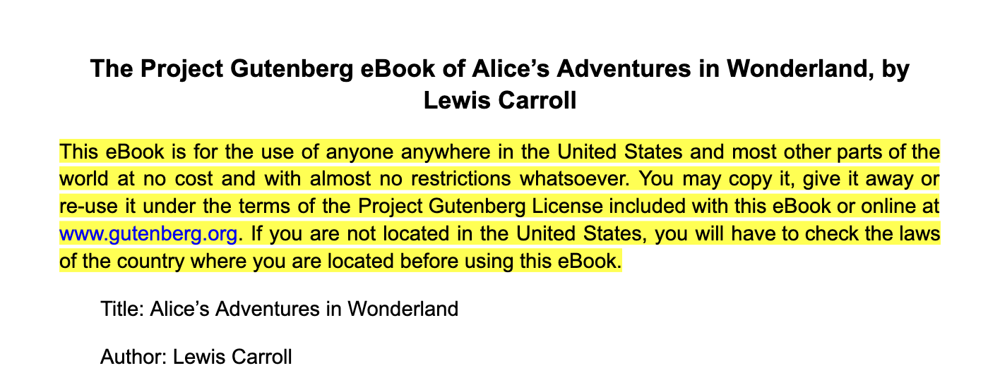
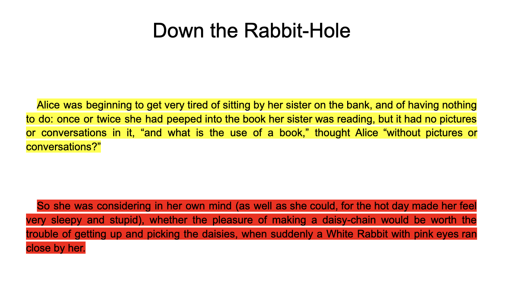

## **Using the Natural Language API from Google Docs**

### **Overview**
The [Natural Language API](https://cloud.google.com/natural-language/) is a pretrained machine learning model that can analyze syntax, extract entities, and evaluate the sentiment of text. You can call the Natural Language API from Google Docs to perform all of these functions.

This task focuses on calling the Natural Language API from Google Docs. You use the Natural Language API to recognize the sentiment of selected text in a Google Doc and highlight it based on that sentiment.

When you complete this task, you are able to select text in a document and mark its sentiment, using a menu choice, as shown below.


Text is highlighted in red for negative sentiment, green for positive sentiment, and yellow for neutral sentiment.

#### Cloud Natural Language API features
**Entity Recognition:** Identify entities in text, such as people, places, and things.          
**Sentiment Analysis:** Analyze the sentiment of text, such as whether it is positive, negative, or neutral.  
**Information Extraction:** Extract information from text, such as dates, times, and price.  
**Question Answering:** Answer questions about text.  
**Integrated REST API:** Access via REST API. Text can be uploaded in the request or integrated with Cloud Storage.

#### What you'll learn
learn how to:
- Call the Natural Language API from Google Docs
- Add menus to Google Docs
- Recognize and work with selected text in Google Docs

### How to start Google Cloud console
- **Open Google Cloud console** use your Google Cloud account credentials
- Google Cloud console opens in this tab
- To access Google Cloud products and services, click the **Navigation menu** or type the service or product name in the **Search field**.


### Enable the Natural Language API

Before you start, make sure that the Natural Language API is enabled.

1. In the Google Cloud console, select **Navigation menu > APIs & Services > Library**.

Search for **Cloud Natural Language API** and click on the API to enable it or to confirm that the API is enabled.


### **Get an API key**
Generate an API user key to pass in the request URL.

1. To create an API key, select **Navigation menu > APIs & Services > Credentials**.

2. Click **Create credentials** at the top and select **API key**:

3. Copy the API key to a text file or a Google Doc to use in a later step. Click **Close**.

Once you have the API key, you are ready to move into Google Docs.

### **Set up your Google Doc**

Before you call the Natural Language API, make an Apps Script program to create the menu, link it to a function to mark the text, and extract the text from the user selection.

1. Create a new [Google Doc](https://docs.google.com/document/create).
2. From within your new document, select the menu item **Extensions > Apps Script**.
3. Delete any code in the script editor and paste in the code below. This code creates a menu item, extracts the text from the current selected text, and highlights the text based on its sentiment. It does not call the Natural Language API yet.

```
/**
* @OnlyCurrentDoc
*
* The above comment directs Apps Script to limit the scope of file
* access for this add-on. It specifies that this add-on will only
* attempt to read or modify the files in which the add-on is used,
* and not all of the user's files. The authorization request message
* presented to users will reflect this limited scope.
*/

/**
* Creates a menu entry in the Google Docs UI when the document is
* opened.
*
*/
function onOpen() {
  var ui = DocumentApp.getUi();
  ui.createMenu('Natural Language Tools')
    .addItem('Mark Sentiment', 'markSentiment')
    .addToUi();
}
/**
* Gets the user-selected text and highlights it based on sentiment
* with green for positive sentiment, red for negative, and yellow
* for neutral.
*
*/
function markSentiment() {
  var POSITIVE_COLOR = '#00ff00';  //  Colors for sentiments
  var NEGATIVE_COLOR = '#ff0000';
  var NEUTRAL_COLOR = '#ffff00';
  var NEGATIVE_CUTOFF = -0.2;   //  Thresholds for sentiments
  var POSITIVE_CUTOFF = 0.2;

  var selection = DocumentApp.getActiveDocument().getSelection();
  if (selection) {
    var string = getSelectedText();

    var sentiment = retrieveSentiment(string);

    //  Select the appropriate color
    var color = NEUTRAL_COLOR;
    if (sentiment <= NEGATIVE_CUTOFF) {
      color = NEGATIVE_COLOR;
    }
    if (sentiment >= POSITIVE_CUTOFF) {
      color = POSITIVE_COLOR;
    }

    //  Highlight the text
    var elements = selection.getSelectedElements();
    for (var i = 0; i < elements.length; i++) {
      if (elements[i].isPartial()) {
        var element = elements[i].getElement().editAsText();
        var startIndex = elements[i].getStartOffset();
        var endIndex = elements[i].getEndOffsetInclusive();
        element.setBackgroundColor(startIndex, endIndex, color);

      } else {
        var element = elements[i].getElement().editAsText();
        foundText = elements[i].getElement().editAsText();
        foundText.setBackgroundColor(color);
      }
    }
  }
}
/**
 * Returns a string with the contents of the selected text.
 * If no text is selected, returns an empty string.
 */
function getSelectedText() {
  var selection = DocumentApp.getActiveDocument().getSelection();
  var string = "";
  if (selection) {
    var elements = selection.getSelectedElements();

    for (var i = 0; i < elements.length; i++) {
      if (elements[i].isPartial()) {
        var element = elements[i].getElement().asText();
        var startIndex = elements[i].getStartOffset();
        var endIndex = elements[i].getEndOffsetInclusive() + 1;
        var text = element.getText().substring(startIndex, endIndex);
        string = string + text;

      } else {
        var element = elements[i].getElement();
        // Only translate elements that can be edited as text; skip
        // images and other non-text elements.
        if (element.editAsText) {
          string = string + element.asText().getText();
        }
      }
    }
  }
  return string;
}

/** Given a string, will call the Natural Language API and retrieve
  * the sentiment of the string.  The sentiment will be a real
  * number in the range -1 to 1, where -1 is highly negative
  * sentiment and 1 is highly positive.
*/
function retrieveSentiment (line) {
//  TODO:  Call the Natural Language API with the line given
//         and return the sentiment value.
  return 0.0;
}
```
**Note:** To learn more about Apps Script, refer to the [Google Apps Script reference](https://developers.google.com/apps-script/).

4. On the menu bar, click **Save project** (Save project button). (The script's name is shown to end users in several places, including the authorization dialog.)

5. Return to your document. Add text to your document. You can use the sample that comes from [Alice in Wonderland on Project Gutenberg](http://www.gutenberg.org/files/11/11-h/11-h.htm#link2HCH0002) (copy and paste the Plain Text UTF-8 version into the document), but feel free to use any text you wish.

6. Reload the document to see the new menu, **Natural Language Tools**, which you created, appear in the Google Docs toolbar.

7. Select text and then the **Mark Sentiment** option from the Natural Language Tools menu. The first time you select this option, you are prompted to authorize the script to run. Click **Continue**, and then confirm your account.

8. **Allow** Natural Language Tools to view and manage documents that this application has been installed in.

9. Once the script is authorized, the selected text is highlighted in yellow, since the stub for sentiment analysis always returns 0.0, which is neutral.



### **Call the Natural Language API**

Once your program can extract text from the selection and highlight it, it's time to call the Natural Language API. All of this is done in the body of the `retrieveSentiment` function.

**Note**: To learn more about the Natural Language API, refer to the [Cloud Natural Language API reference](https://cloud.google.com/natural-language/docs/reference/rest/).

1. Return to the **Extensions > Apps Script** in Google Docs.
2. In the `retrieveSentiment` function, replace "your key here" with your actual API key from the Google Cloud Console.

```
var apiKey = "your key here"; // Replace with your actual API key
```
3. Create a variable to hold the URL of the Natural Language API with your API key appended to it (do not modify this line):

```
var apiEndpoint = "https://language.googleapis.com/v1/documents:analyzeSentiment?key=" + apiKey;
```

4. Build a structure from the line passed into the function that holds the text of the line, along with its type and language. Currently the only supported language is English.

```
  var docDetails = {
    language: 'en-us',
    type: 'PLAIN_TEXT',
    content: line
  };
```
5. Build the entire data payload from the document details by adding the encoding type:

```
  var nlData = {
    document: docDetails,
    encodingType: 'UTF8'
  };
```
6. Create a structure containing the payload and the necessary header information:

```
  var nlOptions = {
    method : 'post',
    contentType: 'application/json',
    payload : JSON.stringify(nlData)
  };
```
7. Make the call, saving the response:

```
  var response = UrlFetchApp.fetch(apiEndpoint, nlOptions);
```
8 The response is returned in JSON format; parse it and extract the score field, if it exists. Return either that field or 0.0.

```
  var data = JSON.parse(response);

  var sentiment = 0.0;
  //  Ensure all pieces were in the returned value
  if (data && data.documentSentiment
          && data.documentSentiment.score){
     sentiment = data.documentSentiment.score;
  }

  return sentiment;
```

The complete code to retrieve the sentiment is below:

```
function retrieveSentiment (line) {
  var apiKey = "your key here"; // Replace with your actual API key
  var apiEndpoint = "https://language.googleapis.com/v1/documents:analyzeSentiment?key=" + apiKey;

  //  Create a structure with the text, its language, its type,
  //  and its encoding
  var docDetails = {
    language: 'en-us',
    type: 'PLAIN_TEXT',
    content: line
  };

  var nlData = {
    document: docDetails,
    encodingType: 'UTF8'
  };

  //  Package all of the options and the data together for the call
  var nlOptions = {
    method : 'post',
    contentType: 'application/json',
    payload : JSON.stringify(nlData)
  };

  //  And make the call
  var response = UrlFetchApp.fetch(apiEndpoint, nlOptions);

  var data = JSON.parse(response);

  var sentiment = 0.0;
  //  Ensure all pieces were in the returned value
  if (data && data.documentSentiment
          && data.documentSentiment.score){
     sentiment = data.documentSentiment.score;
  }

  return sentiment;
}
```
9. Save your script, reload the document, and try out the full program. You may need to re-authorize with your credentials to enable the new functionality. Select different sections of your document to see how the sentiment may differ over its parts.



10. (Optional) Type and then analyze your own words. For example, type and analyze "I'm mad", and then type and analyze "I'm happy". Experiment to see how the Natural Language API interprets different groups, for example if you analyze "I'm happy. I'm happy. I'm sad.". What happens if you add another "I'm sad."?